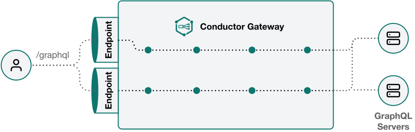

<p align="center">
    &nbsp;<br>
    
    <br>&nbsp;
</p>

> [!IMPORTANT]
> Conductor gateway is still under development, and currently available as alpha.
> Please use it with caution. Feedback is always welcome! 

# Conductor: MIT open-source GraphQL Gateway


[](https://github.com/rust-secure-code/safety-dance/)


Conductor is a cutting-edge, open-source GraphQL Gateway, fully compliant with the GraphQL specification and designed to supercharge any GraphQL API with a number of powerful features and proxy flows. Crafted entirely in Rust, it offers unparalleled performance and a great developer experience, making it an ideal choice for projects requiring advanced GraphQL capabilities.

<p align="center">
    &nbsp;<br>
    
    <br>&nbsp;
</p>

## Key Features

- **Built with Rust**: Focused on performance and reliability, leveraging Rust's safety and concurrency capabilities.
- **Real open-source**: Conductor is open-source (MIT) and free - and will always be.
- **GraphQL Spec Compliance**: Fully adheres to the GraphQL specification, ensuring reliable and standard-compliant behavior.
- **Advanced Gateway Capabilities**: Serves as a dynamic proxy between GraphQL consumers and servers, enhancing GraphQL runtime with robust plugins for caching, authentication, rate limiting, CORS, persisted queries (trusted documents), and OpenTelemetry.
- **Distributed Schemas**: Seamlessly integrates with Apollo Federation, managing all aspects from query planning to response merging.
- **Extensible Endpoint Configuration**: Allows exposure of multiple GraphQL endpoints from a single instance with configurable plugins per endpoint.
- **VRL (Vector Routing Language) Support**: Offers limitless possibilities for custom logic, plugins, and response transformers.
- **Comprehensive Security & Monitoring**: Built-in support for various authentication methods, authorization, rate limiting, and OpenTelemetry for monitoring.
- **Flexible runtime**: Conductor runs either as a binary (and dockerized), and can also run on the Edge (CloudFlare Worker).

## Configuration Overview

Conductor's configuration can be defined in both YAML and JSON formats. The config file contains several key sections:

- **Server**: Configure the HTTP server settings, including port and host.
- **Logger**: Set up logging levels for Conductor's operations.
- **Sources**: Define the GraphQL sources/endpoints that Conductor will interact with. We support both monolith GraphQL and Federation sources.
- **Endpoints**: Specify the GraphQL endpoints Conductor will expose, including path, source, and plugins.
- **Plugins**: List global plugins that apply to all endpoints, including CORS, authentication, and more.

### Configuration File Example

```yaml
server:
  port: 9000

logger:
  level: info

sources:
  - type: graphql
    id: my-source
    config:
      endpoint: https://my-source.com/graphql

endpoints:
  - path: /graphql
    from: my-source
    plugins:
      - type: graphiql

plugins:
  - type: cors
    config:
      allowed_origin: "*"
```

## Running Conductor

Conductor can be ran via the docker image, and it can even be ran via `npx` for quick and convenient usage. It also fully supports running as a WASM on Cloudflare Workers, providing flexibility in deployment options.

```sh
npx @graphql-conductor/bin ./conductor.config.yaml
```

For more details on setting up and running Conductor, [refer to our documentation](https://the-guild.dev/graphql/gateway).

## Contributions

Contributions, issues and feature requests are very welcome. If you are using this package and fixed
a bug for yourself, please consider submitting a PR!

And if this is your first time contributing to this project, please do read our
[Contributor Workflow Guide](https://github.com/the-guild-org/Stack/blob/master/CONTRIBUTING.md)
before you get started off.

### Code of Conduct

Help us keep Conductor open and inclusive. Please read and follow our
[Code of Conduct](https://github.com/the-guild-org/Stack/blob/master/CODE_OF_CONDUCT.md) as adopted
from [Contributor Covenant](https://www.contributor-covenant.org/)

### License

[](https://github.com/the-guild-org/conductor/blob/master/LICENSE)

Conductor is open-source software licensed under MIT.
