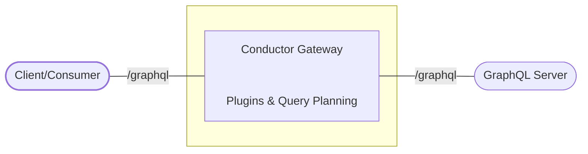
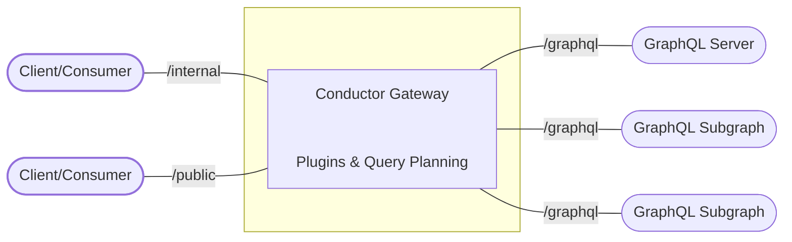

**Conductor** acts as a gateway (or a proxy) to other GraphQL server(s). By adding Conductor to your
GraphQL stack, you can easily:

- Offload custom features (like Trusted Document, Rate Limiting, Security validations, etc.) to
  Conductor.
- Add new features to your GraphQL server without modifying the server code.
- Observe, monitor, and analyze your GraphQL traffic easily.
- Re-expose the same GraphQL server with a modified worflow.
- Federate multiple GraphQL servers into a single GraphQL endpoint.

## How does it work?

Conductor acts as a gateway/proxy between your consumers and your GraphQL server. It intercepts the
GraphQL requests and responses and applies the configured plugins to them. The plugins can be used
to modify the request and response, or to add new features to your GraphQL server.

A simple diagram of how Conductor works is shown below:

The following diagram is more detailed and shows how Conductor can support multiple GraphQL servers,
and to expose multiple GraphQL endpoints:

By allowing multiple GraphQL servers to be exposed through a single GraphQL endpoint, Conductor can
be used to implement Federation and other distributed GraphQL patterns.

In addition, Conductor allow you to expose multiple GraphQL endpoints, each with a different set of
plugins. This allows you to expose the same GraphQL server with different workflows, and have
fine-grained contorl over your GraphQL traffic.
